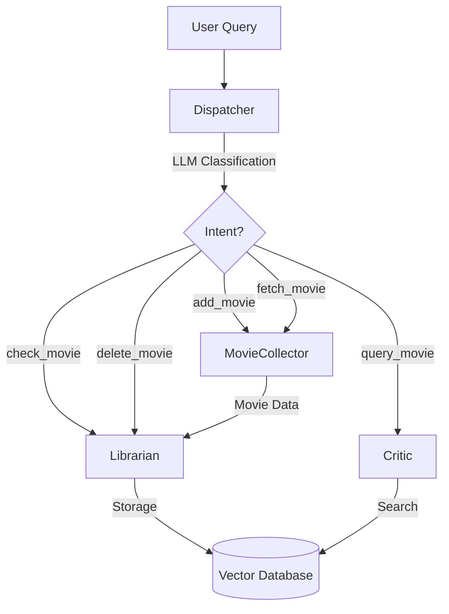

# Multi-Agent Movie RAG System

A scalable, extensible multi-agent architecture for movie recommendation and watchlist management.

## Architecture Overview



## Agents

### 1. Dispatcher (Orchestrator)
**Role:** Intent classification and multi-agent workflow coordination

**Capabilities:**
- Pattern-based routing for explicit commands (`add:`, `find:`, `fetch:`)
- LLM-based intent classification for natural language queries
- Multi-step workflow orchestration using LangGraph StateGraph
- Confidence scoring for routing decisions

**Intents:**
- `add_movie` - Add movies to watchlist
- `fetch_movie` - Fetch movie info without adding
- `query_movie` - Search and get recommendations
- `check_movie` - Check if movie exists in watchlist
- `delete_movie` - Remove movies from watchlist

**Example Queries:**
```bash
# Explicit patterns (instant routing)
python main.py "Add Inception"
python main.py "Find dark sci-fi"
python main.py "Fetch The Matrix"

# Natural language (LLM classification)
python main.py "Put The Godfather to watchlist"
python main.py "Do I have Interstellar?"
python main.py "Remove Pulp Fiction"
python main.py "I want something emotional"
```

---

### 2. MovieCollector (Data Fetching Agent)
**Role:** Fetch movie data from TMDB API

**Capabilities:**
- Intelligent search strategy selection:
  - **Person search** - For queries like "Brad Pitt movies"
  - **Title search** - For specific movie titles
  - **Keyword search** - For genre/theme searches
- Heuristic-based query parsing (no LLM overhead)
- Returns rich movie metadata (title, year, genre, director, cast, plot, rating)

**Search Strategy:**
1. Detect person-related keywords → Person search
2. If short query (≤5 words) → Title search
3. Fallback → Keyword search

**Example Queries:**
```bash
python main.py "Fetch Christopher Nolan films"
python main.py "Lookup Inception"
python main.py "Get sci-fi from 1999"
```

---

### 3. Librarian (Storage Agent)
**Role:** Manage watchlist storage in vector database

**Capabilities:**
- **Create** - Store movie metadata with searchable summaries
- **Read** - Check if movies exist in watchlist
- **Delete** - Remove movies from watchlist
- Vector embedding generation for similarity search
- Metadata management (title, year, genre, director, rating)

**Operations:**
```python
# Add movies (receives data from MovieCollector)
librarian.store_movies(movies: List[MovieInfo])

# Check existence
librarian.check_movie(title: str)

# Delete movie
librarian.delete_movie(title: str)
```

**Example Queries:**
```bash
python main.py "Add The Matrix"
python main.py "Do I have Inception in my watchlist?"
python main.py "Delete The Godfather from watchlist"
```

---

### 4. Critic (Query & Recommendation Agent)
**Role:** Movie search and personalized recommendations

**Capabilities:**
- **Query expansion** (LLM) - Transforms vague queries into searchable concepts
  - Example: "something thrilling" → "suspense, tension, mystery, thriller"
- **Vector similarity search** - Finds relevant movies from watchlist
- **Grounded synthesis** (LLM) - Generates conversational recommendations based only on retrieved context
- Prevents hallucination by grounding responses in database content

**Pipeline:**
1. Expand query with LLM (mood → keywords)
2. Vector similarity search (top-k results)
3. Synthesize conversational response (LLM with context)

**Example Queries:**
```bash
python main.py "Find something dark and cerebral"
python main.py "Recommend emotional Tom Hanks movies"
python main.py "Query action thrillers"
```

---

## Orchestrated Workflows

### Add Movie Workflow
```
User: "Add Inception"
  ↓
Dispatcher (classify intent: add_movie)
  ↓
MovieCollector (fetch from TMDB API)
  ↓
Librarian (store in vector DB)
  ↓
Result: ✓ Added 1 movie
```

### Check Movie Workflow
```
User: "Do I have The Matrix?"
  ↓
Dispatcher (classify intent: check_movie)
  ↓
Librarian (search in vector DB)
  ↓
Result: ✓ Yes! The Matrix (1999) is in your watchlist
```

### Query Movie Workflow
```
User: "Find dark sci-fi"
  ↓
Dispatcher (classify intent: query_movie)
  ↓
Critic (expand query → search → synthesize)
  ↓
Result: Personalized recommendations with explanations
```

### Delete Movie Workflow
```
User: "Remove Pulp Fiction"
  ↓
Dispatcher (classify intent: delete_movie)
  ↓
Librarian (delete from vector DB)
  ↓
Result: ✓ Deleted: Pulp Fiction (1994)
```

---

## Intent Classification

The Dispatcher uses a **two-tier routing system**:

### Tier 1: Pattern Matching (Fast, Explicit)
Instant routing for explicit commands:
- `add:`, `add ` → `add_movie`
- `find:`, `find ` → `query_movie`
- `fetch:`, `fetch ` → `fetch_movie`

### Tier 2: LLM Classification (Flexible, Natural Language)
When no pattern matches, uses LLM to understand intent:

**Prompt:**
```
User query: "Put Inception to watchlist"

Classify intent:
- add_movie (add/save/store a movie)
- query_movie (find/search/recommend)
- fetch_movie (lookup info without adding)
- check_movie (check if exists)
- delete_movie (remove from watchlist)

Response: {"intent": "add_movie", "clean_query": "Inception", "confidence": 0.95}
```

**Benefits:**
- Handles natural language: "I want to watch The Matrix"
- Extracts clean queries: "Put X to watchlist" → clean_query="X"
- Confidence scoring for decision transparency

---

## Agent Registry

Agents self-register using the `BaseAgent` interface:

```python
@classmethod
def get_config(cls) -> AgentConfig:
    return AgentConfig(
        agent_id="movie_collector",
        name="Movie Collector",
        description="Data fetching specialist",
        patterns=["fetch:", "lookup:"],
        keywords=["fetch", "lookup"],
        capabilities=["Search by title", "Search by person"],
        example_queries=["Fetch Inception"],
        requires_llm=False
    )
```

**Registration:**
```python
# agents/__init__.py
AgentRegistry.register(MovieCollector)
AgentRegistry.register(Librarian)
AgentRegistry.register(Critic)
```

**Discovery:**
```bash
python main.py --list-agents
```

---

## Technology Stack

| Component | Technology |
|-----------|-----------|
| **Orchestration** | LangGraph StateGraph |
| **LLM** | OpenRouter (configurable) |
| **Embeddings** | Sentence-Transformers |
| **Vector DB** | ChromaDB |
| **Movie API** | TMDB |
| **CLI** | Rich (formatting) |

---

## Usage Examples

### CLI Commands

```bash
# List all agents
python main.py --list-agents

# Verbose mode (see agent execution traces)
python main.py -v "Add Inception"

# Direct agent selection (bypass dispatcher)
python main.py --agent movie_collector "Fetch The Matrix"

# Auto-routing with orchestration (default)
python main.py "Put Fight Club to watchlist"
python main.py "Do I have Pulp Fiction?"
python main.py "Find something emotional"
python main.py "Remove The Matrix"
```

### Natural Language Examples

**Add to watchlist:**
- "Add Inception"
- "Put The Matrix to watchlist"
- "I want to watch Pulp Fiction"
- "Store Christopher Nolan films"

**Check watchlist:**
- "Do I have Inception?"
- "Is The Matrix in my watchlist?"
- "Do I already have Pulp Fiction?"

**Find recommendations:**
- "Find dark sci-fi"
- "Something emotional"
- "Recommend action thrillers"
- "Movies like Inception"

**Delete from watchlist:**
- "Remove The Matrix"
- "Delete Inception from watchlist"
- "Drop Pulp Fiction"

---

## Extending the System

### Adding a New Agent

1. **Create agent class** extending `BaseAgent`:
```python
class NewAgent(BaseAgent):
    @classmethod
    def get_config(cls) -> AgentConfig:
        return AgentConfig(
            agent_id="new_agent",
            name="New Agent",
            description="What it does",
            patterns=["trigger:"],
            keywords=["trigger"],
            capabilities=["Capability 1"],
            example_queries=["Example query"],
            requires_llm=False
        )
    
    def process(self, query: str) -> dict:
        # Implementation
        return {"result": "data"}
```

2. **Register in `agents/__init__.py`**:
```python
AgentRegistry.register(NewAgent)
```

3. **Update Dispatcher workflows** if needed:
```python
# Add new intent to _classify_intent_with_llm prompt
# Add new workflow node and routing
```

### Adding a New Intent

1. Update `Dispatcher._classify_intent_with_llm()` prompt
2. Add workflow node in `Dispatcher._build_graph()`
3. Implement node method (e.g., `_handle_new_intent()`)
4. Update `main.py` display logic

---

## Design Principles

1. **Separation of Concerns**
   - MovieCollector: Data fetching only
   - Librarian: Storage management only
   - Critic: Query & recommendations only
   - Dispatcher: Orchestration only

2. **Extensibility**
   - Self-describing agents via `AgentConfig`
   - Dynamic registration with `AgentRegistry`
   - No hard-coded routing logic

3. **Flexibility**
   - Pattern matching for explicit commands (fast)
   - LLM classification for natural language (flexible)
   - Confidence scoring for transparency

4. **Grounded Responses**
   - Critic only uses retrieved context
   - No hallucinated movie recommendations
   - All responses cite database content

---

## Configuration

**Environment Variables:**
```bash
# .env
OPENROUTER_API_KEY=your_key_here
TMDB_API_KEY=your_key_here
DEFAULT_MODEL=openai/gpt-4o-mini
```

**Model Selection:**
```bash
# Use default model
python main.py "Find dark sci-fi"

# Override model
python main.py -m openai/gpt-4 "Find dark sci-fi"
```

---

## Future Enhancements

- [ ] Multi-user support with user-specific watchlists
- [ ] Collaborative filtering recommendations
- [ ] Streaming service availability integration
- [ ] Watch history tracking
- [ ] Rating and review collection
- [ ] Social sharing features
- [ ] Mobile app interface
- [ ] Voice command support
