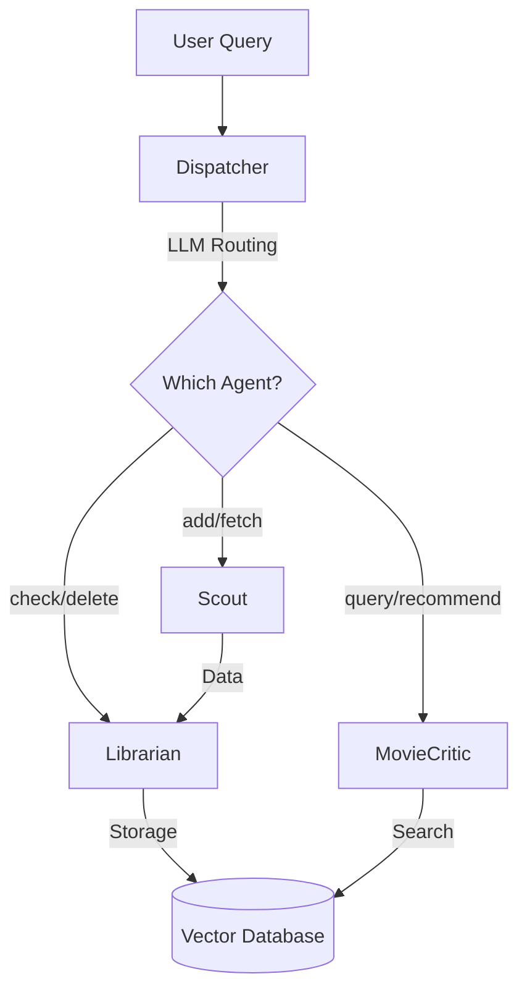

# Multi-Agent System

A scalable, extensible multi-agent architecture for movie recommendation and watchlist management.

## Architecture Overview



## Agents

### 1. Dispatcher (Orchestrator)
**Role:** LLM-based routing and multi-agent workflow coordination

**Capabilities:**
- LLM-based agent selection
- Multi-step workflow orchestration
- Visited agent tracking (prevents loops)
- Automatic completion detection after storage

---

### 2. Scout (Data Fetching Agent)
**Role:** Fetch movie data from TMDB API

**Capabilities:**
- LLM-powered query analysis
- Smart search strategy selection (title/person/keyword)
- Conversational result summaries

**Example Queries:**
```bash
python main.py "Add Inception"
python main.py "Fetch Christopher Nolan films"
```

---

### 3. Librarian (Storage Agent)
**Role:** Manage storage in vector database

**Capabilities:**
- Check if entities exist in storage
- Search existing storage
- Count and filter entities
- Delete entities from storage
- Store items passed from Scout

**Example Queries:**
```bash
python main.py "Do I have Inception?"
python main.py "How many movies do I have?"
python main.py "Remove The Matrix"
```

---

### 4. MovieCritic (Recommendation Agent)
**Role:** Movie search and personalized recommendations

**Capabilities:**
- Query expansion (mood → keywords)
- Vector similarity search
- Grounded synthesis (LLM with context)

**Example Queries:**
```bash
python main.py "Find dark sci-fi"
python main.py "Recommend emotional movies"
```

---

## Workflows

### Add Movie
```
User: "Add Inception"
  ↓
Dispatcher → Scout (fetch from TMDB) → Librarian (store)
  ↓
Result: ✓ Stored 1 movie
```

### Check Movie
```
User: "Do I have The Matrix?"
  ↓
Dispatcher → Librarian (search)
  ↓
Result: Yes/No
```

### Query/Recommend
```
User: "Find dark sci-fi"
  ↓
Dispatcher → MovieCritic (expand → search → synthesize)
  ↓
Result: Recommendations
```

---

## Usage

```bash
# List agents
python main.py --list-agents

# Verbose mode
python main.py -v "Add Inception"

# Direct agent (bypass dispatcher)
python main.py --agent scout "Fetch The Matrix"
python main.py --agent librarian "Show all movies"
python main.py --agent movie_critic "Find thrillers"
```

---

## Configuration

```bash
# .env
GOOGLE_API_KEY=your_key
TMDB_API_KEY=your_key
LLM_MODEL=gemini-2.0-flash
```

---

## Extending

### Adding a New Agent

1. Create class extending `BaseAgent`:
```python
class NewAgent(BaseAgent):
    @classmethod
    def get_config(cls) -> AgentConfig:
        return AgentConfig(
            agent_id="new_agent",
            name="New Agent",
            description="What it does",
            patterns=["trigger"],
            capabilities=["Capability 1"],
            example_queries=["Example"],
        )
    
    def process(self, query: str) -> dict:
        return {"result": "data"}
```

2. Register in `agents/registry.py`
