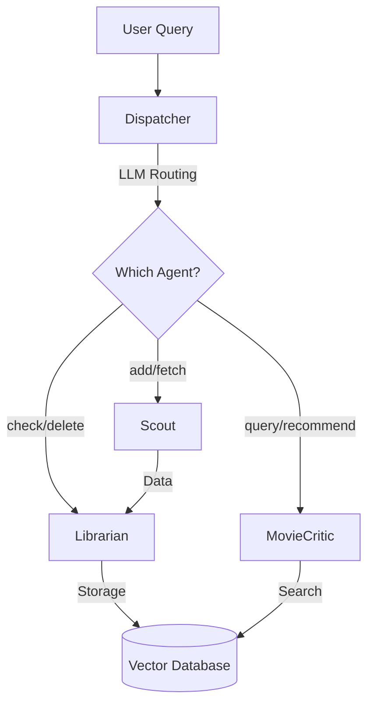

# Multi-Agent System

A scalable, extensible multi-agent architecture for movie recommendation and watchlist management.

## Architecture Overview



## Agents

### 1. Dispatcher (Orchestrator)
**Role:** LLM-based routing and multi-agent workflow coordination

**Capabilities:**
- LLM-based agent selection
- Multi-step workflow orchestration
- Visited agent tracking (prevents loops)
- Automatic completion detection (early exit optimization)
- **Entity Identification:** Distinguishes between "fetching new" (Scout), "checking stored" (Librarian), and "recommending" (Critic)

---

### 2. Scout (Data Fetching Agent)
**Role:** Fetch NEW content from external APIs (TMDB)

**Capabilities:**
- Deep search for movies/people
- Smart search strategy selection
- Returns structured data for Librarian
- **Strict Scope:** Only searches for *new* content (never searches local DB)

**Example Queries:**
```bash
python main.py "Add Inception"
python main.py "Fetch Christopher Nolan films"
```

---

### 3. Librarian (Storage Agent)
**Role:** Manage storage in vector database (Entity-Agnostic)

**Capabilities:**
- **Entity Agnostic:** Handles movies, books, or any text entity
- Check existence (`check_entity`)
- Count and filter (`count_entities`)
- Delete entities (`delete_entity`)
- Store items passed from Scout

**Example Queries:**
```bash
python main.py "Do I have Inception?"
python main.py "How many entities do I have?"
python main.py "Remove The Matrix"
```

---

### 4. MovieCritic (Recommendation Agent)
**Role:** RAG-based search and grounded recommendations

**Capabilities:**
- **Direct RAG Access:** Reads directly from Vector Store
- **Grounded synthesis:** Only recommends what is in the collection
- Query expansion (mood → keywords)
- Full detail retrieval for existing items

**Example Queries:**
```bash
python main.py "Find dark sci-fi in my collection"
python main.py "Give me full details about Inception"
```

---

## Workflows

### Add Content
```
User: "Add Inception"
  ↓
Dispatcher → Scout (fetch) → Librarian (store)
  ↓
Result: ✓ Stored item
```

### Check Content
```
User: "Do I have The Matrix?"
  ↓
Dispatcher → Librarian (check)
  ↓
Result: Yes/No
```

### Deep Search / Recommendation (RAG)
```
User: "Find dark sci-fi" OR "Tell me about Inception"
  ↓
Dispatcher → MovieCritic (Direct RAG Search)
  ↓
Result: Detailed response grounded in collection
```

---

## Usage

```bash
# List agents
python main.py --list-agents

# Verbose mode
python main.py -v "Add Inception"

# Direct agent (bypass dispatcher)
python main.py --agent scout "Fetch The Matrix"
python main.py --agent librarian "Show all entities"
python main.py --agent movie_critic "Find thrillers"
```

---

## Configuration

```bash
# .env
GROQ_API_KEY=your_groq_key
TMDB_API_KEY=your_tmdb_key
LLM_MODEL=openai/gpt-oss-20b
```

---

## Extending

### Adding a New Agent

1. Create class extending `BaseAgent`:
```python
class NewAgent(BaseAgent):
    @classmethod
    def get_config(cls) -> AgentConfig:
        return AgentConfig(
            agent_id="new_agent",
            name="New Agent",
            description="What it does",
            patterns=["trigger"],
            capabilities=["Capability 1"],
            example_queries=["Example"],
        )
    
    def process(self, query: str) -> dict:
        return {"result": "data"}
```

2. Register in `agents/registry.py`
